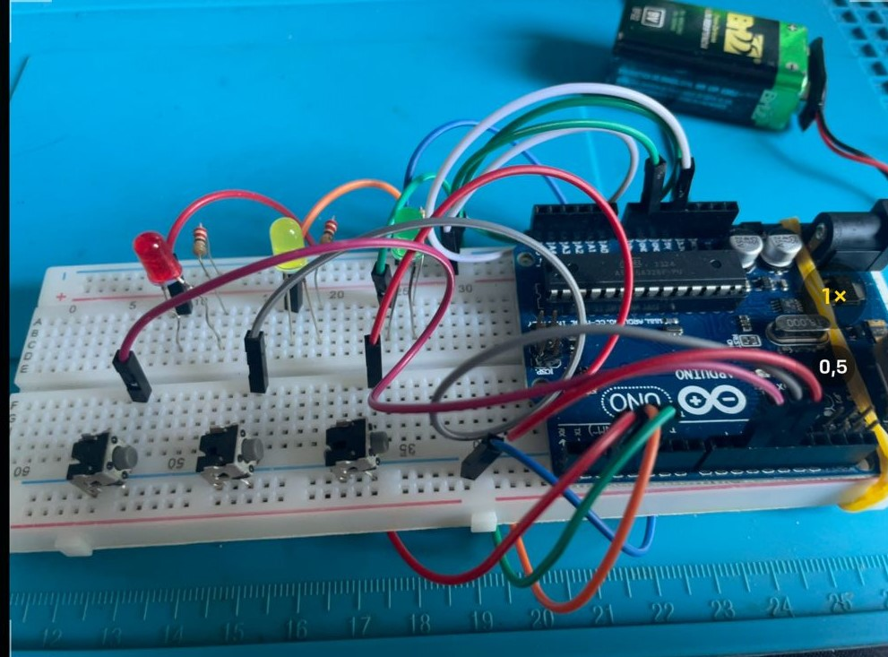

  
  

## 🖥️ Projeto

Esse é um projeto de um jogo de memoria em que o usuário deve acertar as sequencias de led acesos.

## 🚀 Tecnologias

Esse projeto foi desenvolvido durante exercicios do curso de automação com Arduino da Alura.

- C++ (Arduino)
- Github

